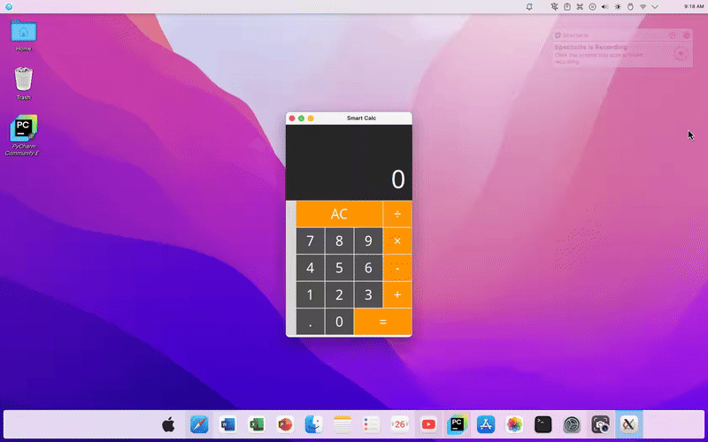

# Smart Calc - A Modern Calculator App

 

## Table of Contents

<!-- TOC -->
* [Smart Calc - A Modern Calculator App](#smart-calc---a-modern-calculator-app)
  * [Table of Contents](#table-of-contents)
  * [About Smart Calc](#about-smart-calc)
  * [Features](#features)
  * [Getting Started](#getting-started)
    * [Prerequisites](#prerequisites)
    * [Installation](#installation)
    * [Running the Application](#running-the-application)
<!-- TOC -->

## About Smart Calc

Smart Calc is a sleek and functional calculator application built using Python's Tkinter library. Designed with a modern, macOS-inspired aesthetic, it provides essential arithmetic operations in an intuitive user interface. This project serves as a practical example of GUI development in Python, demonstrating layout management, event handling, and custom theming.

## Features

* **Basic Arithmetic Operations:** Addition, subtraction, multiplication, and division.
* **Clear All (AC):** Easily reset the calculator.
* **Responsive Design:** Buttons and display adapt to window resizing.
* **macOS-Inspired Theme:** Dark background, vibrant orange operators, and crisp white text for a modern look.
* **Intuitive Layout:** Standard calculator button arrangement for ease of use.

## Getting Started

Follow these instructions to get a copy of the project up and running on your local machine.

### Prerequisites

Before you begin, ensure you have the following installed:

* **Python 3.x:** (e.g., Python 3.8 or newer)
    You can download Python from [python.org](https://www.python.org/downloads/).
* **Tkinter:** Tkinter is usually included with standard Python installations. If you're on Linux, you might need to install it separately:
    ```bash
    # For Debian/Ubuntu
    sudo apt-get install python3-tk
    # For Fedora
    sudo dnf install python3-tkinter
    ```

### Installation

1.  **Clone the repository (or download the source code):**
    ```bash
    git clone [https://github.com/your-username/Smart-Calc.git](https://github.com/your-username/Smart-Calc.git)
    cd Smart-Calc
    ```
    *(If you haven't set up a Git repository yet, you can just download the files and navigate to the project directory.)*

2.  **Create a virtual environment (recommended):**
    ```bash
    python3 -m venv venv
    ```

3.  **Activate the virtual environment:**
    * **On Windows:**
        ```bash
        .\venv\Scripts\activate
        ```
    * **On macOS/Linux:**
        ```bash
        source venv/bin/activate
        ```

4.  **No additional Python packages are typically required beyond Tkinter for this project.**

### Running the Application

Once you have the prerequisites installed and the virtual environment activated, you can run the calculator:

```bash
python3 main.py